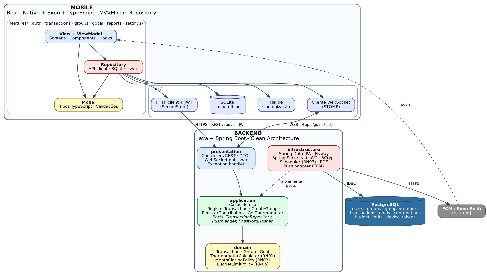
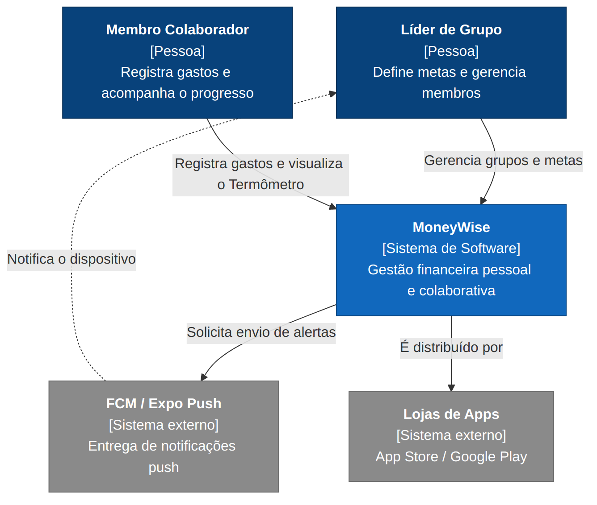
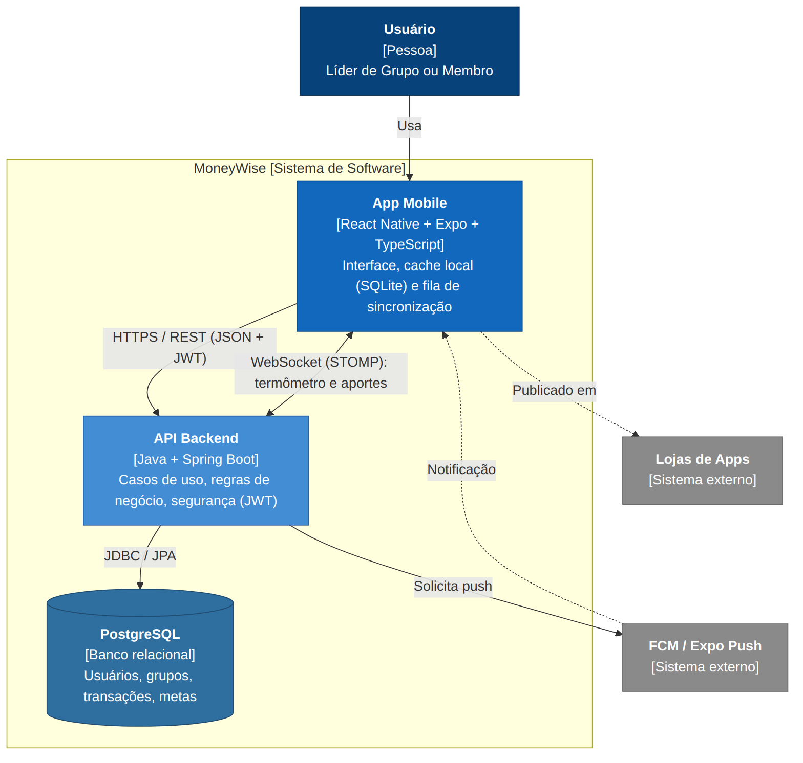
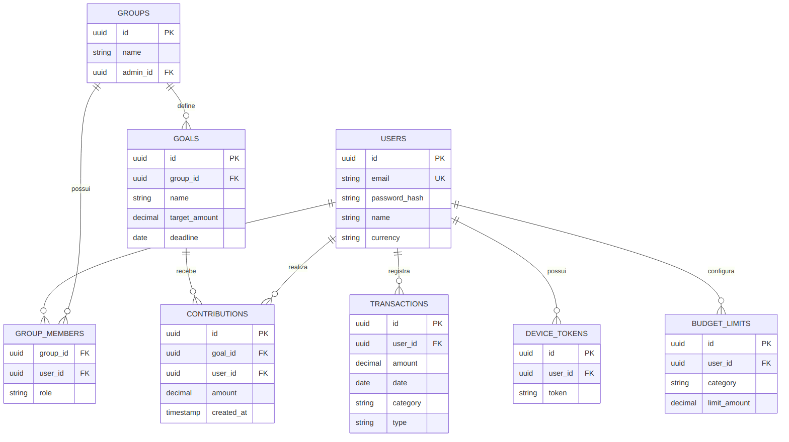
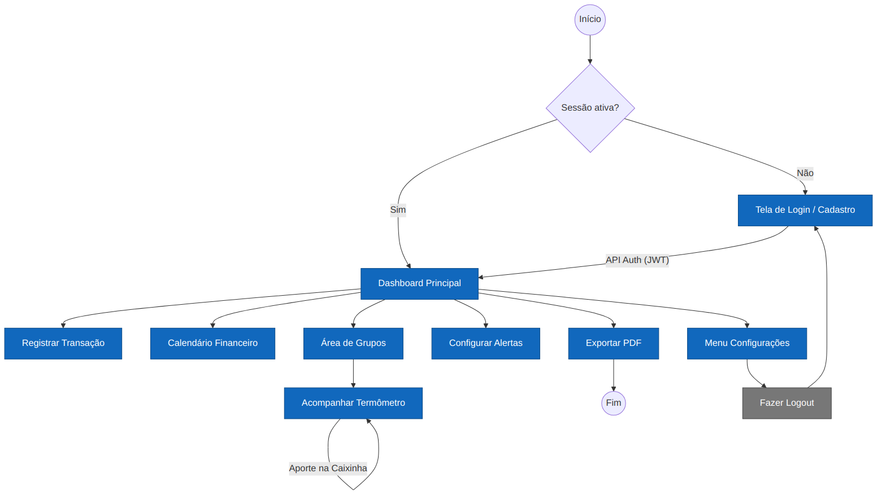
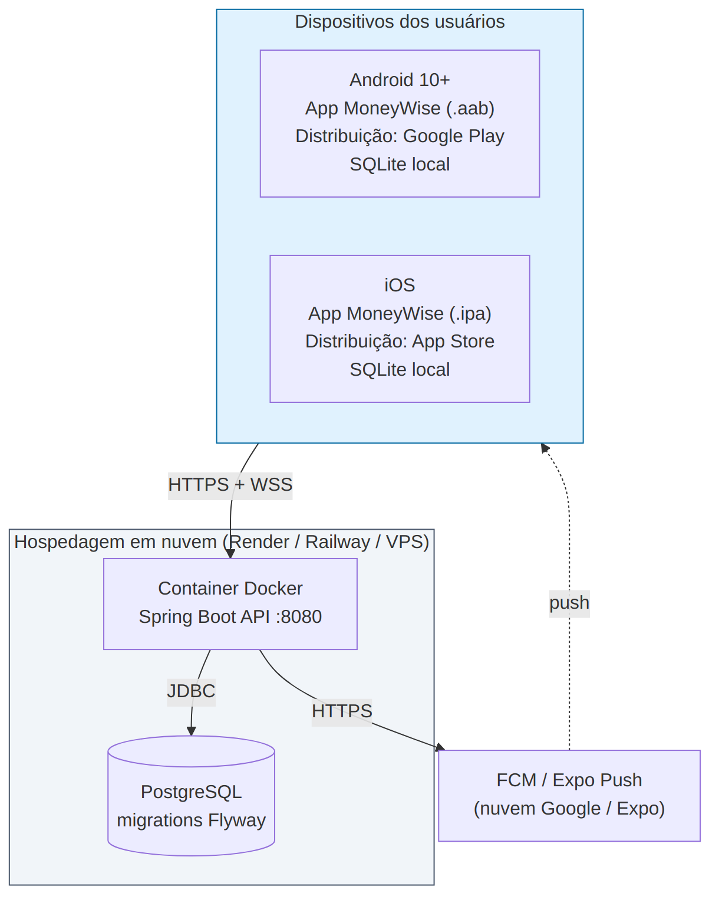

<div align="center">

# 💰 MoneyWise

**Finanças pessoais e colaborativas, com metas em grupo que você acompanha em tempo real.**

Trabalho de Conclusão de Curso · Engenharia de Software · Universidade Católica de Brasília


[Sobre](#-sobre-o-projeto) ·
[Funcionalidades](#-funcionalidades) ·
[Protótipo](#-protótipo) ·
[Arquitetura](#%EF%B8%8F-arquitetura) ·
[Como executar](#-como-executar) ·
[Roadmap](#%EF%B8%8F-roadmap) ·
[Contribuição](#-como-contribuir) ·
[Equipe](#-equipe)

</div>

---

## 📖 Sobre o projeto

O **MoneyWise** é um sistema de gerenciamento de finanças pessoais e colaborativas pensado para jovens adultos, casais e famílias. Com ele, o usuário registra receitas e despesas, acompanha o próprio saldo e, junto com outras pessoas, cria **Caixinhas**: metas financeiras coletivas dentro de um grupo.

O diferencial do MoneyWise é o **Termômetro**, um indicador visual que mostra o progresso de cada Caixinha e é atualizado **em tempo real** para todos os membros do grupo sempre que alguém faz um aporte.

O sistema é formado por:

- um **aplicativo móvel** para Android e iOS, que funciona também **sem internet** e sincroniza os dados quando a conexão volta;
- uma **API REST própria**, que concentra as regras de negócio, a segurança e a comunicação em tempo real;
- um **banco de dados relacional** com o esquema versionado.

> **Privacidade em primeiro lugar:** o saldo pessoal de um usuário nunca é mostrado aos outros membros do grupo. O grupo enxerga apenas os aportes feitos nas Caixinhas.

---

## ✨ Funcionalidades

### Release 1 · MVP

| Módulo | O que o usuário pode fazer |
|---|---|
| 🔐 **Conta e acesso** | Criar conta, entrar, manter a sessão ativa ao reabrir o app e sair com segurança |
| 💸 **Transações** | Registrar, editar, excluir e filtrar receitas e despesas por categoria e período |
| 📊 **Painel** | Ver saldo, entradas e saídas do mês e gastos por categoria |
| 📴 **Modo offline** | Registrar transações sem internet, com sincronização automática na reconexão |
| 👥 **Grupos** | Criar grupos (família ou casal), convidar e remover membros, com papéis Admin e Membro |
| 🎯 **Caixinhas** | Criar metas coletivas com valor e prazo, registrar aportes e ver o histórico |
| 🌡️ **Termômetro** | Acompanhar o progresso da meta, atualizado em tempo real para todo o grupo |

### Release 2

| Módulo | O que o usuário pode fazer |
|---|---|
| 📅 **Calendário financeiro** | Visualizar as movimentações dia a dia |
| 📄 **Relatório em PDF** | Exportar o resumo mensal |
| 🔔 **Alertas de orçamento** | Definir limites por categoria e receber aviso ao atingir 80% |
| ⏰ **Lembretes** | Receber um lembrete após 24 horas sem usar o app |

### Principais regras de negócio

- **RN01:** o Termômetro é calculado no servidor a partir do valor acumulado, do valor da meta e do prazo restante, e é o mesmo para todos os membros.
- **RN02 e RN08:** dados financeiros pessoais não são expostos a outros membros do grupo.
- **RN03:** transações de meses já fechados não podem ser alteradas.
- **RN04:** apenas o Admin remove membros e altera o valor da meta.
- **RN05:** o usuário é alertado ao atingir 80% do limite de uma categoria.
- **RN06:** cada e-mail pode ser usado em apenas uma conta.
- **RN09:** os valores usam a moeda configurada no perfil e são armazenados como decimal, nunca como ponto flutuante.

---

## 🎨 Protótipo

O protótipo de alta fidelidade foi desenvolvido no **Figma** e contém 20 telas.

<!--
  Para exibir as telas aqui: exporte cada frame do Figma como PNG (largura de 390 px é suficiente),
  salve em docs/images/telas/ com os nomes abaixo e remova os comentários da galeria.
-->

<!--
<div align="center">
  
  
  
  
</div>
<br />
<div align="center">
  
  
  
  
</div>
-->

<details>
<summary><strong>Lista completa das telas</strong></summary>

| Fluxo | Telas |
|---|---|
| Primeiro acesso | Onboarding (passos 1, 2 e 3) · Boas-vindas: Entrar ou Cadastrar |
| Autenticação | Entrar na Conta · Criar Nova Conta · Recuperar Senha |
| Finanças pessoais | Dashboard Individual · Extrato de Transações · Adicionar Transação · Adicionar Transação (Variante) |
| Caixinhas | Caixinhas: Lista · Nova Caixinha · Caixinha: Detalhes (Compartilhada) · Caixinha: Detalhes Individual · Convidar Membros · Extrato da Caixinha · Caixinha: Configurações (Individual e Compartilhada) |
| Conta | Meu Perfil |

</details>

---

## 🏗️ Arquitetura

O MoneyWise segue o modelo **cliente-servidor** e é organizado como um **monorepo**. O aplicativo cuida da interface e do armazenamento local para uso offline. A API concentra as regras de negócio, a autenticação, a persistência, o tempo real e as notificações.

<div align="center">
  
  <br />
  <sub>Diagrama de arquitetura: aplicativo em MVVM com Repository e API em Clean Architecture.</sub>
</div>

### Tecnologias

| Camada | Tecnologias |
|---|---|
| **Aplicativo móvel** | React Native · Expo · TypeScript · React Navigation · expo-sqlite (cache e fila offline) · SecureStore (tokens) |
| **API** | Java · Spring Boot · Spring Security · JWT com refresh token · BCrypt · WebSocket/STOMP · springdoc (OpenAPI) |
| **Banco de dados** | PostgreSQL · Flyway (migrations) |
| **Notificações** | Firebase Cloud Messaging ou Expo Push, acionados pela API |
| **Qualidade** | ArchUnit (regras de camadas no backend) · ESLint (regras de import no app) |
| **Infraestrutura** | Docker · Docker Compose · EAS (build e publicação do app) |

### Padrões adotados

**Backend: Clean Architecture.** Cada funcionalidade é dividida em quatro camadas, e as dependências sempre apontam para o domínio.

| Camada | Responsabilidade | Exemplos |
|---|---|---|
| `domain` | Entidades e regras de negócio em Java puro, sem Spring nem JPA | `Goal`, `ThermometerCalculator`, `MonthClosingPolicy` |
| `application` | Casos de uso (um por classe) e ports | `RegisterTransaction`, `CreateGroup`, `TransactionRepository` |
| `infrastructure` | Adapters que implementam os ports com tecnologia real | `JpaTransactionRepository`, `JwtTokenService`, `FcmPushSender` |
| `presentation` | Controllers REST, DTOs e publicação via WebSocket | `TransactionController`, `GoalWebSocketPublisher` |

**Aplicativo: MVVM com Repository.** A tela nunca fala diretamente com a API nem com o banco local.

```
View (tela)  →  ViewModel (hook)  →  Repository  →  API REST · SQLite · fila de sincronização
                        ↓
                  Model (tipos e validações)
```

### Termômetro em tempo real

1. Um membro registra um aporte na Caixinha.
2. A API grava o aporte no PostgreSQL e recalcula o Termômetro no domínio (RN01).
3. A API publica o novo estado no tópico `/topic/goals/{id}` via WebSocket.
4. Todos os aplicativos inscritos atualizam o indicador em menos de 2 segundos.

Só membros do grupo podem se inscrever no tópico, e a conexão exige um JWT válido.

### Modo offline

Toda escrita é gravada primeiro no SQLite do aparelho e marcada como pendente. Quando a conexão volta, a fila de sincronização reenvia as operações em ordem. Cada registro recebe um UUID gerado no próprio aparelho, e a API trata a criação como idempotente, o que evita registros duplicados.

<details>
<summary><strong>Mais diagramas</strong></summary>

<br />

**Diagrama de contexto (C4, nível 1)**



**Diagrama de containers (C4, nível 2)**



**Modelo entidade-relacionamento**



**Fluxo de navegação**



**Diagrama de implantação**



</details>

### API

A API é versionada com o prefixo `/api/v1` e documentada com OpenAPI. Com a API rodando em desenvolvimento, a documentação interativa fica disponível no Swagger UI.

| Recurso | Endpoints |
|---|---|
| Autenticação | `POST /auth/register` · `POST /auth/login` · `POST /auth/refresh` · `POST /auth/logout` |
| Transações | `POST` `GET` `PUT` `DELETE /transactions` · `GET /transactions?category=&from=&to=` |
| Relatórios | `GET /reports/calendar` · `GET /reports/monthly` · `GET /reports/monthly/pdf` |
| Grupos | `POST /groups` · `POST /groups/{id}/invitations` · `DELETE /groups/{id}/members/{userId}` |
| Metas e aportes | `POST /groups/{id}/goals` · `POST /goals/{id}/contributions` · `GET /goals/{id}/thermometer` |
| Alertas e dispositivos | `PUT /settings/budget-limits` · `POST /devices` |
| Tempo real | WebSocket `/ws` · tópico `/topic/goals/{id}` |

---

## 📁 Estrutura do repositório

```
moneywise/
├── backend/               # API em Java + Spring Boot (pom.xml, Dockerfile)
│   └── src/main/java/com/moneywise/
│       ├── shared/        # configuração, exceções, tipo monetário
│       ├── auth/          # cada funcionalidade tem domain/ application/
│       ├── transactions/  #   infrastructure/ e presentation/
│       ├── groups/
│       ├── goals/
│       ├── reports/
│       └── notifications/
├── mobile/                # App em React Native + Expo + TypeScript
│   └── src/
│       ├── core/          # api, storage, sync, realtime, navigation, theme, components
│       ├── features/      # auth, transactions, groups, goals, reports, settings
│       └── types/
├── docs/                  # architecture/, vision/, api/openapi.yaml, images/
├── docker-compose.yml     # PostgreSQL (e API) para desenvolvimento
└── README.md
```

---

## 🚀 Como executar

> 🚧 O projeto está em construção. Os comandos abaixo refletem a estrutura planejada e serão confirmados à medida que as tasks de fundação forem concluídas.

### Pré-requisitos

- [Git](https://git-scm.com/)
- [Docker](https://www.docker.com/) e Docker Compose
- [Java (JDK)](https://adoptium.net/) e Maven, para rodar a API fora do Docker
- [Node.js](https://nodejs.org/) (LTS)
- App **Expo Go** no celular ou um emulador Android/iOS

### 1. Clonar o repositório

```bash
git clone https://github.com/anetef/MoneyWise.git
cd MoneyWise
```

### 2. Configurar as variáveis de ambiente

```bash
cp .env.example .env
# edite o .env com as credenciais do banco
```

### 3. Subir o banco e a API

```bash
docker compose up --build
```

A API fica disponível em `http://localhost:8080`, e as migrations do Flyway são aplicadas automaticamente.

<details>
<summary>Rodar a API fora do Docker</summary>

```bash
docker compose up -d postgres
cd backend
./mvnw spring-boot:run
```

</details>

### 4. Rodar o aplicativo

```bash
cd mobile
npm install
npx expo start
```

Leia o QR Code com o Expo Go ou pressione `a` (Android) ou `i` (iOS) para abrir no emulador.

### Testes

```bash
cd backend && ./mvnw test     # domínio, casos de uso e regras de arquitetura (ArchUnit)
cd mobile && npm run lint     # ESLint com as regras de import entre camadas
```

---

## 🗺️ Roadmap

O desenvolvimento está organizado em milestones no GitHub Projects, e cada task é uma [issue](https://github.com/anetef/MoneyWise/issues).

| Milestone | Objetivo | Status |
|---|---|---|
| **M0 · Fundação** | Monorepo, Docker, projetos base, tema, navegação e armazenamento local | ⏳ Próximo |
| **M1 · Autenticação** | Cadastro, login, sessão persistente, refresh e logout de ponta a ponta | 🔜 Planejado |
| **M2 · Transações e offline** | CRUD de transações, Dashboard, Extrato e sincronização offline | 🔜 Planejado |
| **M3 · Grupos e Caixinhas** | Grupos, convites, metas, aportes e Termômetro em tempo real | 🔜 Planejado |
| **MVP · v1.0.0** | Testes de segurança, roteiro ponta a ponta e release para a `main` | 🔜 Planejado |
| **M4 · Release 2** | Calendário, PDF, alertas de orçamento, notificações e deploy em nuvem | 🔜 Planejado |

---

## 🤝 Como contribuir

O guia completo, com o passo a passo e a Definition of Done, está no [CONTRIBUTING.md](CONTRIBUTING.md).

### Fluxo de branches

| Branch | Uso |
|---|---|
| `main` | Versão estável. Recebe apenas o merge da `develop` na release. |
| `develop` | Integração das tasks aprovadas. |
| `feature/<ID>-<descricao>` | Uma por task, criada a partir da `develop`. Ex.: `feature/SEC-05-register-user` |
| `fix/<ID>-<descricao>` | Correções encontradas durante a integração. |

### Padrões

- **Uma task, uma branch, uma Pull Request.**
- Commits em [Conventional Commits](https://www.conventionalcommits.org/pt-br/) em inglês: `feat:`, `fix:`, `docs:`, `test:`, `refactor:`, `chore:`.
- Título da PR com o ID da task, como `[SEC-05] Cadastro de usuário`, e `Closes #n` na descrição.
- Pelo menos **uma aprovação** de outra pessoa da equipe antes do merge, que é feito com **squash and merge**.
- Nomes de código (classes, arquivos, tabelas e endpoints) em **inglês**. Textos para o usuário e documentação em **português**.

### Prefixos das tasks

| Prefixo | Área | Prefixo | Área |
|---|---|---|---|
| `INF` | Infraestrutura e DevOps | `MOB` | Base do aplicativo |
| `DB` | Banco de dados | `MAU` | Autenticação no app |
| `BE` | Base do backend | `MTX` | Transações no app |
| `SEC` | Autenticação e autorização na API | `MGO` | Grupos e Caixinhas no app |
| `TX` | Transações na API | `MST` | Perfil e configurações no app |
| `GRP` | Grupos na API | `QA` | Qualidade e release |
| `GOAL` | Metas e Caixinhas na API | `L` | Lacuna a decidir pela equipe |
| `REP` | Relatórios | `NOT` | Notificações e alertas |

---

## 👩‍💻 Equipe

| Integrante | Papel |
|---|---|
| Agatha Karenne De Andrade Machado | Desenvolvimento |
| Ana Eduarda Raposo Medeiros | Desenvolvimento |
| Anette Stefany Villalba Palomino | Desenvolvimento |
| Brunno Calado Cavalcante | Desenvolvimento |
| Clarice Christine Soares Viana | Desenvolvimento |
| Débora Cristina Silva Ferreira | Desenvolvimento |

---

## 📚 Documentação

- **Documento de Visão v1.1:** requisitos funcionais (RF-01 a RF-28), não funcionais (RNF-01 a RNF-12) e regras de negócio (RN01 a RN09).
- **Documento de Arquitetura de Software v2.0:** visões arquiteturais, diagramas e decisões (AD-01 a AD-10), em `docs/architecture/`.
- **Contrato da API:** `docs/api/openapi.yaml`, gerado a partir do springdoc.

---

## 📄 Licença

Projeto acadêmico desenvolvido como Trabalho de Conclusão de Curso na Universidade Católica de Brasília.

<div align="center">
<sub>Feito com 💚 pela equipe MoneyWise</sub>
</div>
